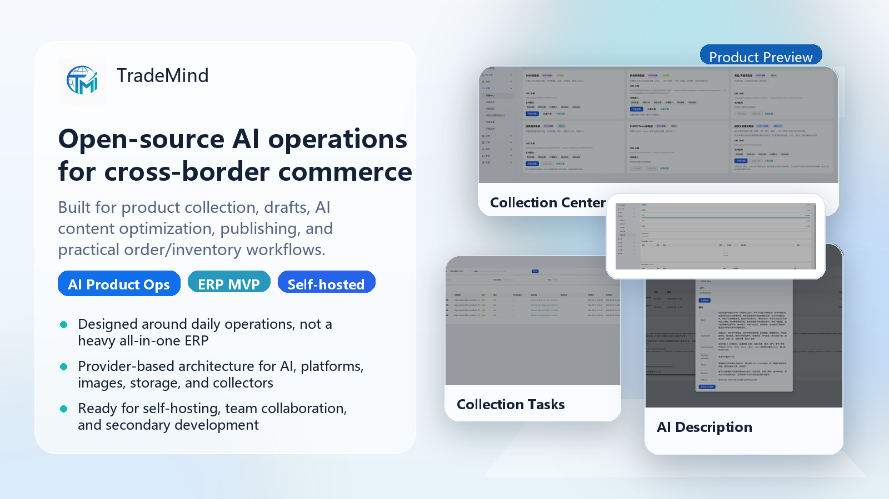

<h1 align="center">TradeMind</h1>

<p align="center">
  <strong>Open-source AI Commerce Operations Platform</strong>
</p>

<p align="center">
  Focused on product collection → drafts → AI content optimization → publishing → order and inventory workflows
</p>

<p align="center">
  <a href="LICENSE"></a>
  
  
  
  
  
</p>

<p align="center">
  <a href="README.md">简体中文</a> | English
</p>

<p align="center">
  <a href="#quick-start">Quick Start</a> ·
  <a href="#screenshots">Screenshots</a> ·
  <a href="#core-capabilities">Core Capabilities</a> ·
  <a href="#architecture-and-stack">Architecture & Stack</a> ·
  <a href="docs/README.md">Docs</a> ·
  <a href="docs/roadmap.md">Roadmap</a>
</p>

<p align="center">
  
</p>

TradeMind is an open-source platform for cross-border commerce sellers and developer teams. It is designed around the operational flow that happens every day: collect products, organize drafts, optimize content with AI, publish listings, and keep orders and inventory in sync.

The project currently serves two priorities: `AI product operations` and a `lightweight cross-platform ERP MVP`. Rather than trying to become a heavy all-in-one ERP, TradeMind focuses on a self-hosted, extensible foundation that teams can adapt to their own workflows.

> Current status: the AI product-operations flow is runnable today; the Douyin Shop integration is in Release Candidate hardening, and real platform E2E still depends on real credentials. See [`docs/DOUYIN_RELEASE_GATE.md`](docs/DOUYIN_RELEASE_GATE.md).

## Positioning

| Area | What TradeMind focuses on |
| --- | --- |
| AI Product Operations | Product collection, drafts, AI titles and descriptions, image processing, and readiness checks. |
| Cross-platform ERP MVP | Store authorization, order sync, SKU matching, inventory sync, and product publishing as a practical MVP loop. |
| Self-hosted Extensibility | Provider-based architecture for AI, storage, image, platform, and collector integrations. |

## Screenshots

The screenshots below come from the local development environment and show the most mature flow today: **collection → draft → AI content optimization**.

<table>
  <tr>
    <td width="50%" align="center">
      
      <br />
      <sub><strong>Collection Center</strong>: collector entry points and batch collection</sub>
    </td>
    <td width="50%" align="center">
      
      <br />
      <sub><strong>Collection Tasks</strong>: URL submission, task tracking, and linked drafts</sub>
    </td>
  </tr>
  <tr>
    <td width="50%" align="center">
      
      <br />
      <sub><strong>Collection Monitor</strong>: worker, task, and batch status visibility</sub>
    </td>
    <td width="50%" align="center">
      
      <br />
      <sub><strong>AI Description Generation</strong>: generate highlights, specs, and descriptions for drafts</sub>
    </td>
  </tr>
</table>

## Core Capabilities

### AI Product Operations

- Product collection from 1688, Pinduoduo, Taobao / Tmall, and custom rules.
- Product draft management for products, SKUs, images, inventory thresholds, collection warnings, and readiness checks.
- AI title optimization and description generation with prompt templates, task records, compare/apply flows, and safe rollback.
- AI image workflows through remove.bg, OpenAI Image, ComfyUI, and async task queues.

### Cross-platform ERP MVP

- Store authorization with a working Douyin Shop OAuth loop, encrypted secrets, and connection tests.
- Order collaboration with sync, SKU matching, and exception handling.
- Inventory collaboration with stock mirrors, alerts, and sync tasks.
- Product publishing via a multi-platform listing center (single-product, multi-shop pre-check and batch draft creation), **multi-product batch publish wizard** (list multi-select → batches and sub-tasks; Phase A2.2 adds production-grade unified/override config UI, effective-config preview, and validation; A2.1 adds batch limits, explicit DB migration, idempotency tests, and production hardening), **batch AI title/description** (Phase A3.1: 4-step wizard → review workspace → conflict-safe apply and undo; **A3.1.1** failure task center integration and legacy entry cleanup; **A3.1.2** real Provider trial run and route smoke acceptance), **batch AI image processing** (Phase A3.2: 5-step wizard → image review workspace → apply/undo; quality check / white background / watermark removal; never auto-overwrites originals; **A3.2.1** real Provider trial, route smoke, apply/undo scripts — see `docs/BATCH_AI_IMAGE_UX_ACCEPTANCE.md`), draft mapping, publish tasks, recovery paths, and manual correction; Douyin Shop supports real platform drafts; other platforms currently use local draft snapshots.
- AI customer-service reply suggestions with manual confirmation before sending.

### Engineering and Extensibility

- Provider abstractions for AI, storage, image, platform, and collector integrations.
- Self-host-friendly setup with PostgreSQL + Redis and a full Docker Compose deployment path.
- Monorepo structure for backend, admin, collector, and docs, making team collaboration easier.

## Architecture and Stack

| Layer | Stack |
| --- | --- |
| Backend | Go + Gin + GORM |
| Admin | React + TypeScript + Ant Design Pro |
| Collector | Node.js + TypeScript + Playwright |
| Data | PostgreSQL + Redis |
| Deploy | pnpm workspace + Docker Compose |
| Extension Points | AI / Storage / Image / Platform / Collector Providers |

## Quick Start

### Local Development

```bash
pnpm install
pnpm install:collector:browsers
pnpm dev
```

Useful commands:

```bash
pnpm check:dev
pnpm dev:infra
pnpm dev:backend
pnpm dev:admin
pnpm dev:collector
pnpm build:admin
pnpm build:collector
```

### Docker Deployment

```bash
cp .env.docker.example .env
docker compose -f docker-compose.full.yml up -d --build
```

Windows PowerShell:

```powershell
Copy-Item .env.docker.example .env
docker compose -f docker-compose.full.yml up -d --build
```

Default URLs:

| Service | URL |
| --- | --- |
| Admin | <http://127.0.0.1:8000> |
| Backend Health | <http://127.0.0.1:8080/health> |
| Collector Health | <http://127.0.0.1:3001/health> |

Further reading:

- [docs/development.md](docs/development.md)
- [docs/docker-deployment.md](docs/docker-deployment.md)
- [docs/env.md](docs/env.md)

## Current Priorities

| Priority | Focus |
| --- | --- |
| Priority 1 | Strengthen the AI product-operations flow: collection, drafts, AI copy, image processing, and readiness checks. |
| Priority 2 | Improve the cross-platform ERP MVP, with Douyin Shop as the first real platform loop. |
| Not the current goal | Multi-warehouse, procurement, finance, heavy WMS / OMS, and complex BI are intentionally out of scope for now. |

For more detail, see [docs/roadmap.md](docs/roadmap.md) and [docs/PROGRESS.md](docs/PROGRESS.md).

## Documentation

- [docs/README.md](docs/README.md): documentation hub.
- [docs/development.md](docs/development.md): local development, debugging, and commands.
- [docs/docker-deployment.md](docs/docker-deployment.md): full Docker Compose deployment and operations.
- [docs/api.md](docs/api.md): API contracts, response conventions, and auth notes.
- [docs/provider.md](docs/provider.md): provider extension model and safety constraints.
- [docs/architecture.md](docs/architecture.md): architecture, layering, and data flow.
- [docs/branching.md](docs/branching.md): branch strategy and PR workflow.

## Contributing and Community

- Read [CONTRIBUTING.md](CONTRIBUTING.md) before opening a PR.
- Review [SECURITY.md](SECURITY.md) for security reporting.
- PRs that improve screenshots, sample data, or docs are also welcome.
- Sponsorship info is available in [docs/sponsor.md](docs/sponsor.md).

## License

This project is open-sourced under the [Apache License 2.0](LICENSE).
