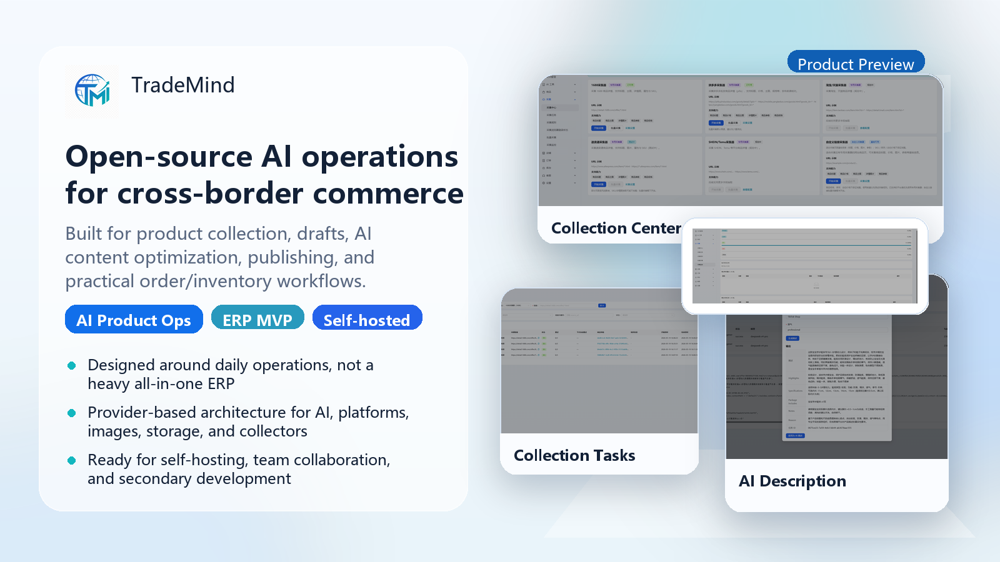
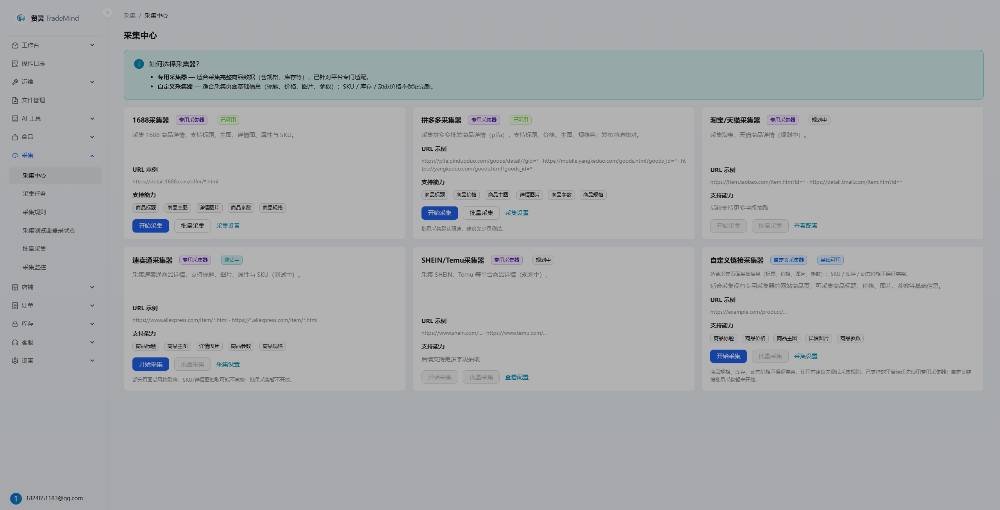
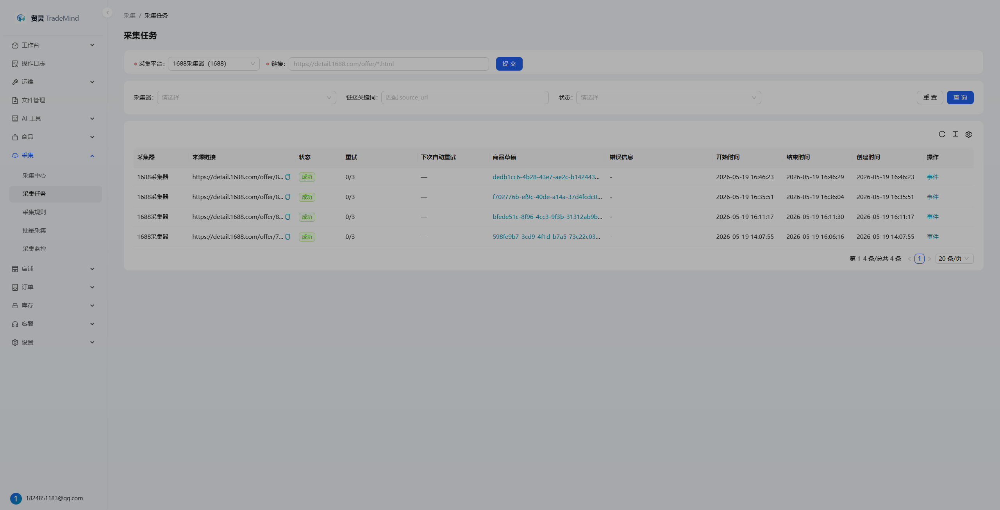

<h1 align="center">TradeMind</h1>

<p align="center">
  <strong>Open-source AI Platform for Cross-border Commerce Growth</strong>
</p>

<p align="center">
  From a product link to a ready-to-run, publishable, continuously managed product asset
</p>

<p align="center">
  <a href="LICENSE"></a>
  
  
  
  
  
</p>

<p align="center">
  <a href="README.md">简体中文</a> | English
</p>

<p align="center">
  <a href="#quick-start">Quick Start</a> ·
  <a href="#screenshots">Screenshots</a> ·
  <a href="#core-capabilities">Core Capabilities</a> ·
  <a href="#architecture-and-stack">Architecture & Stack</a> ·
  <a href="docs/README.md">Docs</a>
</p>

<p align="center">
  
</p>

TradeMind is an open-source AI operations platform for cross-border sellers, brand teams, and developers. It turns product collection, enrichment, content generation, image processing, draft collaboration, platform listing, order sync, and inventory coordination into one observable workflow, so teams can build a durable product engine instead of moving data by hand.

Whether you are building a private commerce workspace or adding AI and platform integrations to an existing business, TradeMind gives you an auditable, self-hosted foundation that can be extended around your own operating model. Your data stays under your control, while every provider and workflow can evolve with your team.

## Why TradeMind

| Area | What TradeMind focuses on |
| --- | --- |
| AI Product Growth | Product collection, draft management, AI titles and descriptions, image processing, and publish-readiness checks in one workspace. |
| Multi-platform Operations | Store authorization, order sync, SKU matching, inventory mirrors, and product publishing around a unified product asset. |
| Open and Controlled | Provider-based architecture for AI, storage, image, platform, and collector integrations, with permissions, audit trails, and human confirmation for critical actions. |

## Screenshots

The screenshots below show TradeMind's core workflow: **collection → draft → AI content optimization**. Every step from product discovery to publish-ready content stays visible and traceable.

<table>
  <tr>
    <td width="50%" align="center">
      
      <br />
      <sub><strong>Collection Center</strong>: collector entry points and batch collection</sub>
    </td>
    <td width="50%" align="center">
      
      <br />
      <sub><strong>Collection Tasks</strong>: URL submission, task tracking, and linked drafts</sub>
    </td>
  </tr>
  <tr>
    <td width="50%" align="center">
      
      <br />
      <sub><strong>Collection Monitor</strong>: worker, task, and batch status visibility</sub>
    </td>
    <td width="50%" align="center">
      
      <br />
      <sub><strong>AI Description Generation</strong>: generate highlights, specs, and descriptions for drafts</sub>
    </td>
  </tr>
</table>

## Core Capabilities

### AI Product Operations

- Product collection from 1688, Pinduoduo, Taobao / Tmall, and custom rules.
- Product draft management for products, SKUs, images, inventory thresholds, collection warnings, and readiness checks.
- AI title optimization and description generation with prompt templates, task records, compare/apply flows, and safe rollback.
- AI image workflows through remove.bg, OpenAI Image, ComfyUI, and async task queues.

### Multi-platform Operations

- Store authorization with Douyin Shop OAuth, encrypted secrets, and connection tests.
- Order collaboration with sync, SKU matching, and exception handling.
- Inventory collaboration with stock mirrors, alerts, and sync tasks.
- ERP procurement and returns with warehouse and supplier master data, purchase-order approval, partial receipts, receipt-bound supplier returns, warehouse movements, idempotent processing, and an Admin workspace with separated approval/execution duties and revision conflict protection.
- Product publishing via a multi-platform listing center, single-product and batch draft creation, multi-product publish workflows, AI title/description review, AI image processing, draft mapping, publish tasks, recovery paths, and manual correction.
- AI customer-service reply suggestions with manual confirmation before sending.

### Engineering and Extensibility

- Provider abstractions for AI, storage, image, platform, and collector integrations.
- Self-host-friendly setup with PostgreSQL + Redis and a full Docker Compose deployment path.
- Monorepo structure for backend, admin, collector, and docs, making team collaboration easier.
- Reliability foundation with unified idempotency on critical writes, AI apply/undo protection, Webhook fast ACK, and worker leases against stale writeback.

## Architecture and Stack

| Layer | Stack |
| --- | --- |
| Backend | Go + Gin + GORM |
| Admin | React + TypeScript + Ant Design Pro |
| Collector | Node.js + TypeScript + Playwright |
| Data | PostgreSQL + Redis |
| Deploy | pnpm workspace + Docker Compose |
| Extension Points | AI / Storage / Image / Platform / Collector Providers |

## Quick Start

### Local Development

```bash
pnpm install
pnpm install:collector:browsers
pnpm dev
```

Useful commands:

```bash
pnpm check:dev
pnpm dev:infra
pnpm dev:backend
pnpm dev:admin
pnpm dev:collector
pnpm build:admin
pnpm build:collector
pnpm seed:demo-data
pnpm seed:demo-permissions
```

Development uses isolated PostgreSQL and Redis services, while the complete automated regression suite runs continuously in GitHub Actions.

### Docker Deployment

```bash
cp .env.example .env
# Set a unique random COLLECTOR_SERVICE_TOKEN (at least 32 characters) in .env
docker compose -f docker-compose.full.yml up -d --build
```

Windows PowerShell:

```powershell
Copy-Item .env.example .env
# Set a unique random COLLECTOR_SERVICE_TOKEN (at least 32 characters) in .env
docker compose -f docker-compose.full.yml up -d --build
```

GitHub Actions publishes multi-architecture GHCR images for backend, admin, and collector. To use prebuilt images:

```bash
# Set COLLECTOR_SERVICE_TOKEN in .env, then override the image references below
TRADEMIND_BACKEND_IMAGE=ghcr.io/lien0219/trademind:backend-main-v0.2.0
TRADEMIND_ADMIN_IMAGE=ghcr.io/lien0219/trademind:admin-main-v0.2.0
TRADEMIND_COLLECTOR_IMAGE=ghcr.io/lien0219/trademind:collector-main-v0.2.0
docker compose -f docker-compose.full.yml pull backend admin collector
docker compose -f docker-compose.full.yml up -d --no-build
```

Only image-related changes on `main` automatically publish validation images. The shared GHCR package uses `backend-*`, `admin-*`, and `collector-*` tags to keep the service images separate, and ordinary builds do not move the service `latest` tags. After the release change is merged into `main`, push a `v<version>` Git tag matching `deploy/IMAGE_VERSION`; only that validated release publishes service version and service `latest` tags. Pin the workflow's `image@sha256:<manifest-digest>` reference for controlled deployments. See [Docker deployment](docs/docker-deployment.md) for the release procedure and package URL.

Default URLs:

| Service | URL |
| --- | --- |
| Admin | <http://127.0.0.1:8000> |
| Backend Health | <http://127.0.0.1:8080/health> |

In the full Compose stack, Collector is reachable only by the backend over the internal network and has no host port. PostgreSQL and Redis bind to host loopback only. Platform connections default to a controlled draft workflow: non-Douyin flows create local listing drafts first, while Douyin actions pass through permission checks and an operator-reviewed task before creating a platform draft.

The Admin root URL serves the public product homepage, with direct links to sign in or register before entering the operations workspace.

Further reading:

- [docs/development.md](docs/development.md)
- [docs/docker-deployment.md](docs/docker-deployment.md)
- [docs/env.md](docs/env.md)

## Documentation

- [docs/README.md](docs/README.md): documentation hub.
- [docs/development.md](docs/development.md): local development, debugging, and commands.
- [docs/docker-deployment.md](docs/docker-deployment.md): full Docker Compose deployment and operations.
- [docs/api.md](docs/api.md): API contracts, response conventions, and auth notes.
- [docs/provider.md](docs/provider.md): provider extension model and safety constraints.
- [docs/architecture.md](docs/architecture.md): architecture, layering, and data flow.
- [docs/branching.md](docs/branching.md): branch strategy and PR workflow.

## Contributing and Community

- Read [CONTRIBUTING.md](CONTRIBUTING.md) before opening a PR.
- Review [SECURITY.md](SECURITY.md) for security reporting.
- PRs that improve screenshots, sample data, or docs are also welcome.
- Sponsorship info is available in [docs/sponsor.md](docs/sponsor.md).

## License

This project is open-sourced under the [Apache License 2.0](LICENSE).
