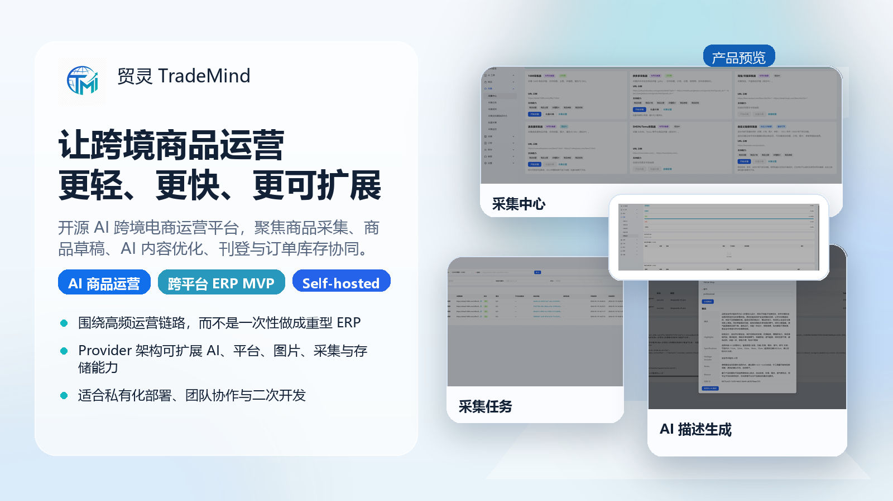
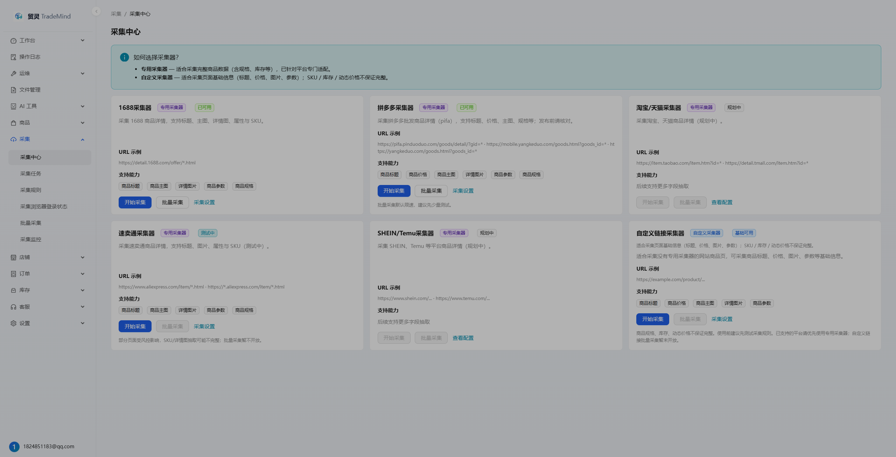
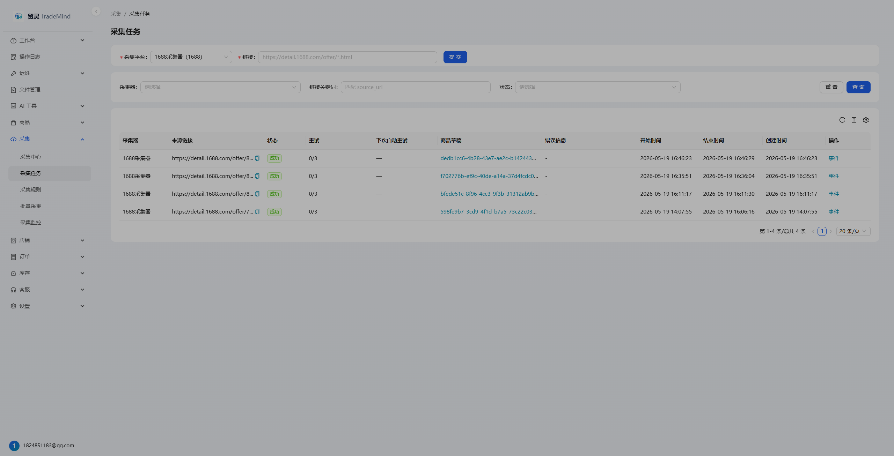
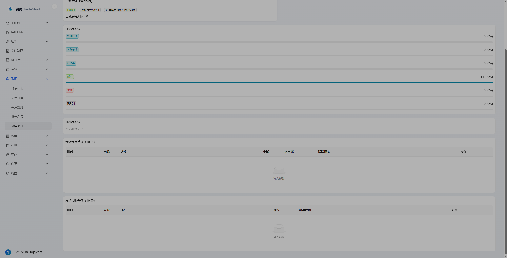
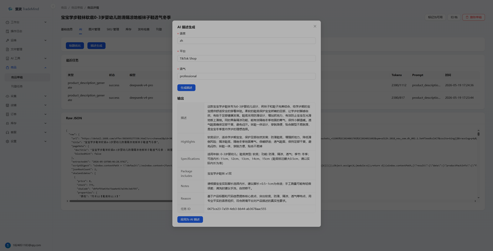

<h1 align="center">贸灵 TradeMind</h1>

<p align="center">
  <strong>开源 AI 跨境电商运营平台</strong>
</p>

<p align="center">
  聚焦 商品采集 → 商品草稿 → AI 内容优化 → 商品刊登 → 订单与库存协同
</p>

<p align="center">
  <a href="LICENSE"></a>
  
  
  
  
  
</p>

<p align="center">
  简体中文 | <a href="README.en.md">English</a>
</p>

<p align="center">
  <a href="#快速开始">快速开始</a> ·
  <a href="#界面预览">界面预览</a> ·
  <a href="#核心能力">核心能力</a> ·
  <a href="#架构与技术栈">架构与技术栈</a> ·
  <a href="docs/README.md">文档中心</a> ·
  <a href="docs/roadmap.md">Roadmap</a>
</p>

<p align="center">
  
</p>

TradeMind 是一个面向跨境卖家与开发团队的开源 AI 运营平台，优先解决“采集、整理、优化、刊登、同步”这条主链路。项目当前聚焦两条主线：`AI 商品运营工具` 与 `多平台跨境 ERP MVP`。

与传统重型 ERP 不同，TradeMind 当前不追求多仓、采购、财务、WMS / OMS 或复杂 BI 的一次性全量覆盖，而是提供一个可私有化部署、可二次开发、可通过 Provider 扩展的平台底座。

> 当前状态：AI 商品运营主线已可运行；Douyin Shop 集成处于 Release Candidate 加固阶段，真实平台 E2E 仍依赖真实凭证，详见 [`docs/DOUYIN_RELEASE_GATE.md`](docs/DOUYIN_RELEASE_GATE.md)。

## 项目定位

| 方向 | TradeMind 的做法 |
| --- | --- |
| AI 商品运营 | 围绕商品采集、草稿管理、AI 标题与描述、图片处理、发布前检查构建高频运营链路。 |
| 跨平台 ERP MVP | 优先打磨店铺授权、订单同步、SKU 匹配、库存同步、商品刊登等可运行闭环。 |
| 私有化与扩展 | 通过 AI / Storage / Image / Platform / Collector Provider 抽象扩展，适合自部署与二次开发。 |

## 界面预览

以下截图来自本地开发环境，展示当前最成熟的主线能力：**商品采集 → 商品草稿 → AI 内容优化**。

<table>
  <tr>
    <td width="50%" align="center">
      
      <br />
      <sub><strong>采集中心</strong>：采集器入口与批量采集</sub>
    </td>
    <td width="50%" align="center">
      
      <br />
      <sub><strong>采集任务</strong>：链接提交、状态追踪与草稿关联</sub>
    </td>
  </tr>
  <tr>
    <td width="50%" align="center">
      
      <br />
      <sub><strong>采集监控</strong>：Worker、任务与批次状态分布</sub>
    </td>
    <td width="50%" align="center">
      
      <br />
      <sub><strong>AI 描述生成</strong>：生成卖点、规格与描述并应用到草稿</sub>
    </td>
  </tr>
</table>

## 核心能力

### AI 商品运营

- 商品采集：支持 1688、拼多多、淘宝/天猫与自定义规则采集。
- 商品草稿：统一管理商品、SKU、图片、库存阈值、采集告警与发布前检查。
- AI 内容：支持标题优化、描述生成、Prompt 模板、结果对比、人工应用与撤销。
- AI 图片：支持 remove.bg、OpenAI Image、ComfyUI 等 Provider，并通过异步任务队列执行。

### 多平台跨境 ERP MVP

- 店铺授权：已具备 Douyin Shop OAuth 闭环、敏感配置加密与连接测试。
- 订单协同：支持订单同步、SKU 匹配、异常工作台等基础能力。
- 库存协同：支持库存镜像、预警与平台同步任务。
- 商品刊登：支持多平台刊登中心（单商品多店铺预检查与批量创建刊登草稿）、**多商品批量刊登向导**（商品列表多选 → 批次与子任务；Phase A2.2 含生产级统一配置 / 单独覆盖 UI、生效配置预览与配置校验；A2.1 含批量上限、显式 migration、幂等测试与生产收口）、**批量 AI 标题/描述**（Phase A3.1：四步向导 → 复核工作台 → 冲突保护应用与撤销；**A3.1.1** 失败任务中心联动与旧版入口梳理；**A3.1.2** 真实 Provider 试跑与路由 smoke 验收）、**批量 AI 图片处理**（Phase A3.2：五步向导 → 图片复核工作台 → 应用/撤销；质量检查 / 白底图 / 去水印等；不自动覆盖原图）、刊登草稿映射、发布任务、失败回收与人工校正；抖店可创建真实平台草稿，其他平台当前以本地草稿快照为主。
- AI 客服：支持建议回复与人工确认外发，避免 MVP 阶段自动外发风险。

### 工程化与扩展

- Provider 架构：AI、存储、图片、平台、采集能力均通过 Provider 抽象扩展。
- 自部署友好：默认 PostgreSQL + Redis，支持本地开发和 Docker Compose 完整部署。
- Monorepo 协作：backend、admin、collector 与文档规则统一维护，适合团队协作与持续演进。

## 架构与技术栈

| 层级 | 技术栈 |
| --- | --- |
| Backend | Go + Gin + GORM |
| Admin | React + TypeScript + Ant Design Pro |
| Collector | Node.js + TypeScript + Playwright |
| Data | PostgreSQL + Redis |
| Deploy | pnpm workspace + Docker Compose |
| Extension Points | AI / Storage / Image / Platform / Collector Providers |

## 快速开始

### 本地开发

```bash
pnpm install
pnpm install:collector:browsers
pnpm dev
```

常用命令：

```bash
pnpm check:dev
pnpm dev:infra
pnpm dev:backend
pnpm dev:admin
pnpm dev:collector
pnpm build:admin
pnpm build:collector
```

### Docker 部署

```bash
cp .env.docker.example .env
docker compose -f docker-compose.full.yml up -d --build
```

Windows PowerShell：

```powershell
Copy-Item .env.docker.example .env
docker compose -f docker-compose.full.yml up -d --build
```

默认访问地址：

| 服务 | 地址 |
| --- | --- |
| Admin | <http://127.0.0.1:8000> |
| Backend Health | <http://127.0.0.1:8080/health> |
| Collector Health | <http://127.0.0.1:3001/health> |

更多说明：

- [本地开发](docs/development.md)
- [Docker 部署](docs/docker-deployment.md)
- [环境变量](docs/env.md)

## 当前重点

| 优先级 | 当前聚焦 |
| --- | --- |
| 第一优先级 | 持续强化 AI 商品运营主线：采集、草稿、AI 文案、图片处理、发布前检查。 |
| 第二优先级 | 打磨多平台跨境 ERP MVP，优先完成 Douyin Shop 的真实业务闭环。 |
| 暂不扩展 | 多仓、采购、财务、重型 WMS / OMS、复杂 BI 等能力暂不作为当前阶段目标。 |

详细规划见 [docs/roadmap.md](docs/roadmap.md) 与 [docs/PROGRESS.md](docs/PROGRESS.md)。

## 文档导航

- [docs/README.md](docs/README.md)：完整文档入口。
- [docs/development.md](docs/development.md)：本地开发、调试与常用命令。
- [docs/docker-deployment.md](docs/docker-deployment.md)：Docker Compose 完整部署与运维说明。
- [docs/api.md](docs/api.md)：API 契约、统一返回与鉴权说明。
- [docs/provider.md](docs/provider.md)：Provider 扩展机制与安全约束。
- [docs/architecture.md](docs/architecture.md)：系统架构、分层与数据流说明。
- [docs/branching.md](docs/branching.md)：分支策略与 PR 规则。

## 贡献与社区

- 贡献代码或文档前，请先阅读 [CONTRIBUTING.md](CONTRIBUTING.md)。
- 安全问题请参考 [SECURITY.md](SECURITY.md)。
- 如果你愿意补充更好的截图、示例数据或文档，也非常欢迎提交 PR。
- 赞助方式见 [docs/sponsor.md](docs/sponsor.md)。

## License

本项目基于 [Apache License 2.0](LICENSE) 开源。
