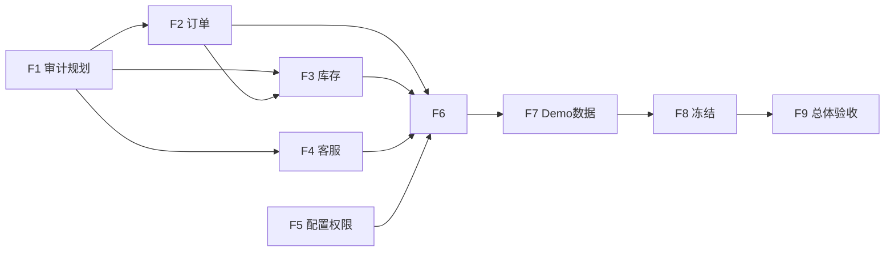

# TradeMind 全项目后续开发计划（Phase F2–F9）

> **Phase F1**（2026-06-29）完成全项目功能缺口审计与路线规划。
> **Phase F8**（2026-06-30）功能冻结与 P0/P1 清零完成。**F2–F8 ✅** · **当前 F9** 总体验收待启动。
> **当前状态**：**Full Project Functionality In Progress** · **MVP Demo Ready** · **非 Production Ready** · 抖店 **Release Candidate** · Tag **pending**

## 阶段总览

```text
F1  功能缺口审计与路线规划          ✅
F2  订单中心与订单异常工作台完善      ✅
F3  库存中心与库存同步完善            ✅
F4  客服消息与 AI 回复建议完善        ✅
F5  系统配置状态中心与权限角色完善    ✅
F6  总 Dashboard 与全局体验完善      ✅
F7  全项目 Demo 数据升级              ✅
F8  全项目功能冻结（P0/P1 清零）      ✅
F9  最终总体验收                      ← 当前
F9  最终总体验收（人工 + 真实预发 + 抖店 E2E + 灰度）
```

---

## Phase F1：全项目功能缺口审计与路线规划 ✅

| 项 | 内容 |
| --- | --- |
| **目标** | 梳理 34 模块完成度；定义 MVP 主链路；规划 F2–F9；P0–P3 缺口分级 |
| **输入** | 现有代码、文档、R1 验收结果 |
| **输出** | `FULL_PROJECT_FUNCTION_MAP.md`、`FULL_PROJECT_MVP_MAIN_FLOW.md`、`FULL_PROJECT_DEVELOPMENT_PLAN.md`、`FULL_PROJECT_MVP_GAP_AUDIT.md`；更新 PROGRESS / README / DEMO_CHECKLIST |
| **完成标准** | 四份文档就绪；go test + admin build 通过；**不**打 tag、**不**标记 Production Ready |
| **不做** | 最终人工测试、真实预发、抖店 E2E、生产灰度 |

---

## Phase F2：订单中心与订单异常工作台完善 ✅

| 项 | 内容 |
| --- | --- |
| **目标** | 订单同步、列表、详情、商品明细、SKU 匹配状态、异常工作台、失败任务联动 |
| **输入** | 现有 `order`、`ordersync`、`orderexception` 模块 |
| **输出** | 订单详情页增强；异常工作台与失败任务中心双向深链；SKU 匹配状态可视化；同步任务 partial_success 重试 UX |
| **完成标准** | 主链路步骤 8–9 每步有明确入口、失败兜底、下一步跳转；订单类失败 100% 进任务中心 |
| **不做** | 售后、退款、财务结算、发票、复杂物流 |

**建议任务：**
1. 订单详情独立页或抽屉（明细 + SKU 匹配 + 库存影响）
2. 异常工作台 bulk 操作与筛选增强
3. 订单同步 partial_success 页级错误展示
4. 失败任务中心 `order_sync` 深链到具体订单/页

---

## Phase F3：库存中心与库存同步完善 ✅

| 项 | 内容 |
| --- | --- |
| **目标** | 库存预警、扣减记录、平台同步状态、失败重试、SKU 未绑定阻断、异常进失败任务中心 |
| **输入** | 现有 `inventory` 模块、抖店 `sku.syncStock` |
| **输出** | 库存 Tab 与同步任务状态一致；未绑定 SKU 全链路中文阻断；同步失败一键重试 |
| **完成标准** | 主链路步骤 10–11 闭环可 Demo；库存异常可从 Dashboard 直达 |
| **不做** | 多仓 WMS、自动补货、采购预测、复杂库存成本 |

**建议任务：**
1. 商品详情库存 Tab 展示 publication SKU 绑定与最近同步
2. 库存同步批次详情 partial_success 项重试
3. `inventory_sync_enabled` 配置状态提示（设置页 + Dashboard）
4. 扣减失败 → 异常工作台 → 失败任务中心联动

---

## Phase F4：客服消息与 AI 回复建议完善 ✅

| 项 | 内容 |
| --- | --- |
| **目标** | 会话列表、消息详情、AI 回复建议、人工编辑、人工确认发送、发送失败兜底、关联订单/商品 |
| **输入** | 现有 `customerchat`、`customersync` |
| **输出** | 客服工作台生产级 UX；发送失败进失败任务中心；订单/商品上下文侧栏 |
| **完成标准** | 主链路步骤 12–14 可 Demo；**不**自动发送 |
| **不做** | 自动发送、复杂工单、售后退款、机器人全自动接管 |

**建议任务：**
1. 会话详情关联订单号 / 商品草稿
2. AI 建议编辑历史与版本
3. `send-platform-message` 失败 → taskcenter
4. 待回复计数进 Dashboard / 工作台

---

## Phase F5：系统配置状态中心与权限角色完善 ✅

| 项 | 内容 |
| --- | --- |
| **目标** | 配置状态中心；AI/OCR/Storage/平台凭证状态；管理员/运营/只读角色；权限矩阵；无权限提示 |
| **输入** | `settings`、`admin_users`、integrations overview |
| **输出** | 新页面或 `/settings/integrations` 增强为「配置健康中心」；RBAC middleware；角色管理 API + 页 |
| **完成标准** | 新运营可 5 分钟内判断「系统是否配好」；只读角色无法改设置/发送客服 |
| **不做** | 多租户计费、复杂 SSO |

**建议任务：**
1. 聚合 test-ai / test-storage / test-ocr / test-connection 最近结果
2. `admin` / `operator` / `viewer` 角色与路由守卫
3. 敏感配置脱敏与无权限 403 中文页

---

## Phase F6：总 Dashboard 与全局体验完善 ✅

| 项 | 内容 |
| --- | --- |
| **目标** | 总运营首页：采集/商品/AI/发布/刊登/订单/库存/客服/失败/配置提醒 |
| **输入** | `operationdashboard`、`aiopsworkbench`、taskcenter |
| **输出** | 扩展 `/dashboard/product-operations` 或新增 `/dashboard/operations` 总览 |
| **完成标准** | 主链路 16 步均可从 Dashboard 一键进入；异常区 0 也展示 |
| **不做** | 复杂 BI、自定义报表 |

**建议任务：**
1. 新增 KPI：订单异常、库存告警、客服待回复、配置未完成
2. 统一待办聚合（工作台 + 订单 + 客服）
3. 空状态引导文案

---

## Phase F7：全项目 Demo 数据升级 ✅

| 项 | 内容 |
| --- | --- |
| **目标** | 构造覆盖采集→商品→AI→刊登→订单→库存→客服→失败任务的完整业务样本 |
| **输入** | `scripts/seed-demo-data.*`、现有 20 slot |
| **输出** | 扩展 seed 脚本；`docs/DEMO_DATASET.md` v2；`demo-dataset.orders|inventory|customer|dashboard|full-project.json`；F7 smoke 脚本；[`DEMO_SEEDING_GUIDE.md`](DEMO_SEEDING_GUIDE.md) |
| **完成标准** | 无真实凭证时可走查主链路 16 步（抖店步骤为 mock/local_draft）；`demo-auto-acceptance` Phase F7-Auto |
| **不做** | 真实平台数据写入；打 tag；Production Ready |

**2026-06-30 交付摘要**：`seed-demo-data` + `seed-demo-permissions`；Demo 账号三角色；Dashboard 10 KPI 探测；专项 smoke 与文案复扫 passed。

---

## Phase F8：全项目功能冻结 ✅

| 项 | 内容 |
| --- | --- |
| **目标** | P0/P1 清零；F7 剩余项收口；功能冻结规则 |
| **输入** | F2–F7 交付物、GAP_AUDIT |
| **输出** | [`FUNCTION_FREEZE_P0_P1_AUDIT.md`](FUNCTION_FREEZE_P0_P1_AUDIT.md)、[`FUNCTION_FREEZE_RULES.md`](FUNCTION_FREEZE_RULES.md)、dev edge-case seed API、sensitiveConfirm / 采集提示 |
| **完成标准** | P0/P1 = 0（代码）；`demo-auto-acceptance` Phase F8-Auto；go test + admin build |
| **不做** | 新模块、真实 E2E、tag、Production Ready |

**2026-06-30 交付摘要**：dev-only `POST /dev/demo-seed/full-project-edge-cases`；刊登配置 sensitiveConfirm；采集店铺归属提示；F9 准备清单。

---

## Phase F9：最终总体验收 ← 当前

| 项 | 内容 |
| --- | --- |
| **目标** | 人工完整走查；真实预发；真实 Storage；抖店真实 E2E；灰度观察；Production Ready 决策 |
| **输入** | F8 冻结版、真实凭证、预发环境 |
| **输出** | 总体验收报告；可选 `v0.1.0-demo` tag；Production Ready 判定 |
| **完成标准** | DEMO_CHECKLIST 全勾；抖店 E2E 非 `blocked_by_real_credentials`；48–72h 灰度无 P0 |
| **人工必须** | 多分辨率截图；浏览器后退/刷新；备份回滚实跑 |

**本阶段（F1）明确不做 F9 内容。**

---

## 缺口优先级规则（F2–F8 执行）

| 级别 | 定义 | 处理阶段 |
| --- | --- | --- |
| **P0** | 主链路断点：无入口、无保存、无兜底、无法下一步、越权、误发布 | F2–F5 必须消减 |
| **P1** | 影响真实试用：状态不清、跳转不清、错误不清、无法恢复 | F2–F6 |
| **P2** | 体验优化：空状态、按钮位置、筛选项、字段说明 | F6–F7 |
| **P3** | 后续增强：复杂 BI、自动化策略、高级报表 | F9 后或 deferred |

---

## 依赖关系



---

## 相关文档

- [FULL_PROJECT_FUNCTION_MAP.md](FULL_PROJECT_FUNCTION_MAP.md)
- [FULL_PROJECT_MVP_MAIN_FLOW.md](FULL_PROJECT_MVP_MAIN_FLOW.md)
- [FULL_PROJECT_MVP_GAP_AUDIT.md](FULL_PROJECT_MVP_GAP_AUDIT.md)
- [PROGRESS.md](PROGRESS.md)
